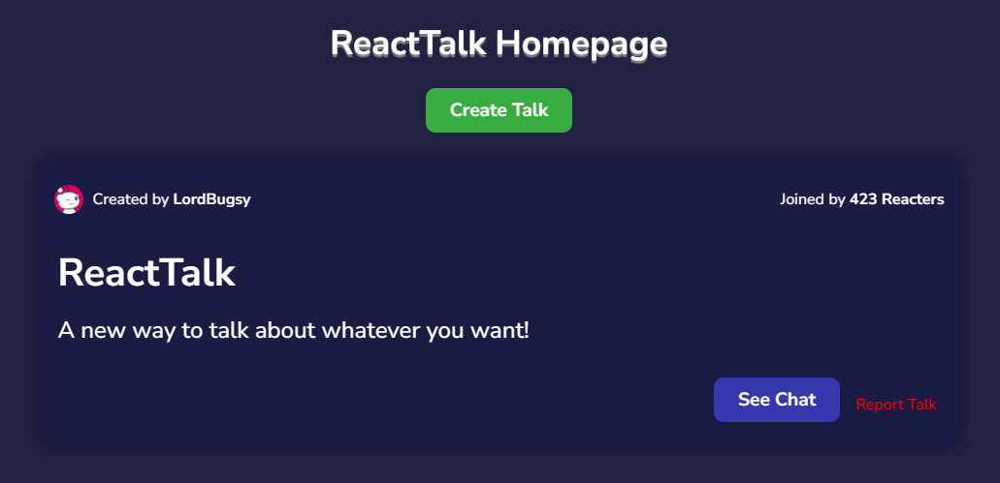

# ReactTalk


ReactTalk is a real-time chat application where users can create and join discussions on various topics. It allows users to sign up, create accounts, and participate in "talks" (live chat rooms).

## Features
- **User Authentication:** Reacters can create an account and log in to access the application.
- **Create Talks:** Reacters can create "talks" with a title and description. These talks serve as chat rooms where users can discuss specific topics.
- **Join and Leave Talks:** Reacters can join talks to participate in discussions or leave talks when they are done.
- **Report and Delete Talks:** Reacters can report talks for inappropriate content, and the creators of talks have the ability to delete them.
- **Search for Talks:** Reacters can search for talks based on their titles or descriptions to find discussions that interest them.
- **Profile Informations:** Reacters can, in their account settings, look at which Talks they've created and joined.

## Technologies Used:
Frontend: ReactJS
Backend: Express
Database: MongoDB

## Getting Started
### Prerequisites
- **Node.js**: Ensure you have Node.js installed. You can download it from [here](https://nodejs.org/).
- **MongoDB**: You will need a MongoDB URI to connect your application to a MongoDB database. If you don't have a MongoDB account, you can create one for free at [MongoDB Atlas](https://www.mongodb.com/cloud/atlas).

### Installing
1. Clone the repository:
```bash
git clone https://github.com/LordBugsy/ReactTalk.git
```

2. Run the app:
```bash
npm start
```

And voilà! I have added many comments and explanations in both the Backend and Frontend folders to help you understand how and why each code was done that way! :)

## Licence
This project is licensed under the MIT License - see the [LICENCE file](./Licence.txt) for details.

## Contact and Contributions
If you have any questions, suggestions, or would like to discuss the project further, feel free to reach out:

- **GitHub**: [LordBugsy](https://github.com/LordBugsy)
- **Twitter/X**: [Bugsy](https://twitter.com/mylordbugsy)
